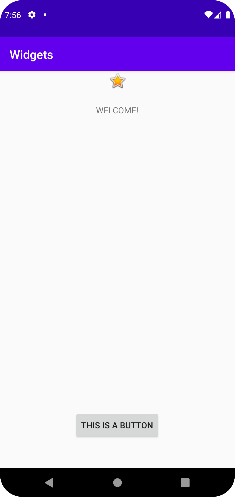

# Rapport

Inom layout > activity_main.xml kan en layout läggas till, jag valde
constraintlayout.

Button, textview och en imageview ligger i layouten, det går att drag
and drop dessa widgets genom att trycka på "Design". 

Margin sätts med density-independed pixels (dp) så att det fungerar på 
enheter med olika storlekar:
```
    android:layout_marginBottom="48dp"
```

Appen ser ut som sådan:
